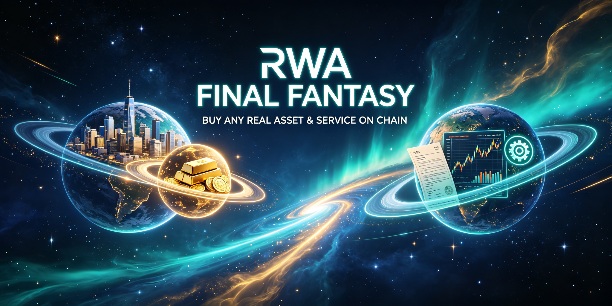
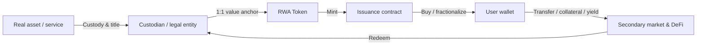

# RWA Final Fantasy

**English** · [中文](README.md)

> Buy any real-world asset & service with a token — on one chain, in one universe.

<p align="center">
  
</p>

[](LICENSE)
[](https://github.com/xpzxjr/RWA-Final-Fantasy)
[](https://x.com/Gary0X0)

---

## 📌 What is this?

**RWA Final Fantasy** is an open universe that tokenizes real-world assets (Real-World Assets, RWA) and services onto the blockchain.

In this universe:

- A condominium in Singapore, a batch of US Treasuries, a case of Moutai in Shanghai, a 30-minute consultation session…
- can all be packaged into **on-chain tokens**,
- and anyone can **buy, fractionalize, transfer, and trade** them with a single verifiable asset token.

Real-world value and imagination, forged on the same chain.

> ⚠️ Name notice: This is an independent open-source project. "Final Fantasy" is used here as a conceptual homage only, with no affiliation to or endorsement by SQUARE ENIX and its *FINAL FANTASY* game series. A trademark search is strongly recommended before a formal release.

---

## 🧠 Why we build this (Market context)

- As of mid-2025, global on-chain RWA value surpassed **$26 billion**, up more than 5x from 2022 — one of the fastest-growing segments in digital assets (CertiK, July 2025 report).
- **Private credit** and **tokenized treasuries** (e.g. US T-bills) are the two largest segments; multiple institutions project a **$16–30 trillion** market by 2030.
- The EU's **MiCA** regulation is now fully in effect, providing a clear cross-border compliance framework for RWA tokenization; traditional giants such as BlackRock and Franklin Templeton have already entered.

**Pain points & opportunities:**

| Traditional asset | Pain point | After RWA tokenization |
|---|---|---|
| Real estate | High barrier, illiquid, slow | Fractional, instant transfer, globally accessible |
| Private credit / bonds | Institutional-only, opaque | On-chain transparency, programmable yield |
| Physical goods / collectibles | Hard to verify, hard to split | On-chain provenance, fractional ownership |
| Professional services | High trust cost, hard to standardize | Smart-contract escrow, verifiable delivery |

---

## ✨ Core features

- **Everything tokenizable**: assets and services unified into one verifiable on-chain token standard
- **Low barrier to entry**: fractional buying, join at any amount
- **On-chain transparency**: asset status, holders, and transfer history fully auditable
- **Programmable rules**: yield distribution, locks, and buybacks executed by smart contracts
- **Open universe**: third-party issuers / service providers can plug in and co-build the ecosystem

---

## ⚙️ How it works



**Core flow (simplified MVP version):**

1. **List**: asset owner submits asset info → custodian completes off-chain title, valuation, and custody
2. **Mint**: after review, tokens are minted on-chain at a 1:1 ratio
3. **Trade**: users buy with stablecoins / native tokens, holding whole or fractional units
4. **Yield / redeem**: asset cash flows are distributed automatically pro-rata; off-chain redemption available on request

---

## 🏷️ Supported asset & service categories (roadmap priority)

| Priority | Category | Description | Compliance complexity |
|---|---|---|---|
| 🥇 P0 | Tokenized treasuries / yield products | US T-bills, short-term bills; most mature market | Medium |
| 🥈 P1 | Private credit / receivables | On-chain debt financing; precedents include RealT, Centrifuge | High |
| 🥉 P2 | Fractional real estate | Tokenized homes / apartments with rental dividends | High |
| 🎯 P3 | Physical goods / collectibles | Gold, wine, art; provenance + custody | Medium |
| 🧩 P4 | Service vouchers | Consulting, courses, membership rights tokenization | Low |

> Suggestion: start your MVP from **P0 or P4** — lowest compliance complexity and the easiest story to tell.

---

## 🪙 Tokenomics

> ⚠️ Design draft only; must be reviewed by qualified legal counsel for your target jurisdiction before launch.

- **Asset Token**: represents a claim on a real-world asset, 1:1 anchored, redeemable
- **Platform Token** (optional): governance, fee discounts, ecosystem incentives
  - Total supply: ______ (TBD)
  - Allocation: team __% / ecosystem __% / early community __% / treasury __% / liquidity __%
- **Compliance positioning**: whether the token is a "utility token" or a "security" determines the legal path — define it first, issue later

---

## 🚀 Quick Start

```bash
# Clone the repository
git clone https://github.com/xpzxjr/RWA-Final-Fantasy.git
cd RWA-Final-Fantasy

# Install dependencies (example)
npm install

# Run locally
npm run dev
```

> Full docs in [docs/](docs/); smart contracts and tests in [contracts/](contracts/).

---

## 🔒 Security & compliance statement (must read)

> **This is not legal advice. Consult a qualified lawyer before launch.**

1. **Mainland China**: Virtual currency trading and ICO/STO are prohibited in mainland China. This project **does not issue or trade tokens to users within mainland China**.
2. **United States**: If a token constitutes an "investment contract", it falls under SEC securities law (Howey Test); assess whether registration or an exemption is required.
3. **European Union**: MiCA is now fully in effect, providing a unified issuance framework — a relatively clear compliance path.
4. **Hong Kong / Singapore**: Licensed paths and regulatory sandboxes exist and are common choices for the Asian market.
5. The project must implement: **KYC/AML, geo-restrictions, legal opinions, and third-party audits**.

---

## 🗺️ Roadmap

| Phase | Content | Status |
|---|---|---|
| 2026 Q3 | Whitepaper / prototype / community cold start | 🚧 In progress |
| 2026 Q4 | MVP: first asset category on-chain + testnet | ⏳ Upcoming |
| 2027 Q1 | Mainnet / first compliant issuance | Planned |
| 2027 Q2+ | Open ecosystem: onboard third-party issuers | Planned |

---

## 🤝 Contributing

Welcome to the universe! Any help counts:

- Open an [Issue](https://github.com/xpzxjr/RWA-Final-Fantasy/issues) (bug, idea, asset-category suggestion)
- Open a [Pull Request](https://github.com/xpzxjr/RWA-Final-Fantasy/pulls)
- Pick up a [`good first issue`](https://github.com/xpzxjr/RWA-Final-Fantasy/labels/good%20first%20issue) task
- Join the community and share your ideas (links below)

Please read [CONTRIBUTING.md](CONTRIBUTING.md) and the [Code of Conduct](CODE_OF_CONDUCT.md) first.

**Contributors**: thank you to everyone who makes this universe more complete ❤️ (auto-generated list)

---

## 💬 Community

- Telegram: RWA Final Fantasy (https://t.me/+ZZCfw-sBVYcxYzg1)
- X (Twitter): [@Gary0X0](https://x.com/Gary0X0)
- Discord / Chinese community (WeChat / Feishu group): TBD

---

## 📄 License

[MIT](LICENSE)

---

## ✅ Pre-launch checklist

- [ ] Legal opinion: token classification + target-jurisdiction compliance path
- [ ] Third-party smart contract audit
- [ ] Polish README / whitepaper / website / logo
- [ ] Prepare launch assets (demo video, GIFs, one-page visual)
- [ ] Complete KYC/AML and geo-restriction design

> Full version: `RWA-Final-Fantasy-Launch-Checklist.md` (same directory).
