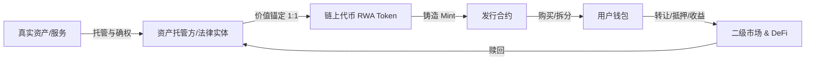

# RWA-Final-Fantasy
This is a universe you can buy any real assets and services via token on blockchain. 

**中文** · [English](README.en.md)

> 一个用链上代币即可购买任何真实资产与服务的开放宇宙。
> Buy any real-world asset & service with a token — on one chain, in one universe.

<p align="center">
  
</p>

[](LICENSE)
[](https://github.com/xpzxjr/RWA-Final-Fantasy)
[](https://x.com/Gary0X0)

---

## 📌 这是什么

**RWA Final Fantasy（RWA·最终幻想）** 是一个把真实世界资产（Real-World Assets, RWA）与服务代币化的开放宇宙。

在这个宇宙里：

- 一栋新加坡的公寓、一批美国国债、一箱上海的茅台、一场咨询顾问的 30 分钟服务……
- 都可以被打包成**链上代币（Token）**，
- 任何人用一枚可验证的资产代币即可**购买、拆分、转让、流转**。

现实世界的资产与想象力，铸进同一条链。

> ⚠️ 项目名说明：本项目为独立开源项目，"Final Fantasy" 仅作概念借用，与 SQUARE ENIX 的游戏《FINAL FANTASY》无任何关联，也未获得其授权。正式发布前建议完成商标检索（见文末"上线前必做"）。

---

## 🧠 为什么做这个（市场背景）

- 截至 2025 年中，全球链上 RWA 总价值已突破 **260 亿美元**，较 2022 年增长超 5 倍，成为数字资产领域增长最快的赛道之一（CertiK 2025 年 7 月报告）。
- 私募信贷与代币化国债（如美债）是当前两大主力，合计占链上 RWA 的绝大部分；2030 年市场规模被多家机构预测在 **16 万亿～30 万亿美元** 区间。
- 欧盟 MiCA 法规已全面生效，为 RWA 代币化提供了清晰的跨境合规框架；贝莱德、富兰克林邓普顿等传统巨头均已入场。

**痛点与机会：**

| 传统资产 | 痛点 | RWA 化之后 |
|---|---|---|
| 房地产 | 门槛高、流动性差、交易慢 | 碎片化、秒级流转、全球可购 |
| 私募信贷/债券 | 机构专属、不透明 | 链上透明、可编程收益 |
| 实物商品/藏品 | 难验证真伪、难拆分 | 链上溯源、可拆分 |
| 专业服务 | 信任成本高、难标准化 | 智能合约托管、可验证交付 |

---

## ✨ 核心特性

- **万物可代币化**：资产与服务统一抽象为一种可验证的链上资产凭证（Token）
- **低门槛购买**：碎片化购买，支持任意金额入场
- **链上透明**：资产状态、持有人、流转记录全部可审计
- **可编程规则**：收益分配、锁定、回购由智能合约自动执行
- **开放宇宙**：第三方发行方/服务商可接入，共建生态

---

## ⚙️ 工作原理（How it works）



**核心流程（MVP 阶段简化版）：**

1. **上架**：资产所有者提交资产信息 → 托管方完成链下确权、估值、托管
2. **铸造**：审核通过后，在链上按 1:1 铸造对应代币
3. **交易**：用户用稳定币/原生代币购买，可整枚或碎片持有
4. **收益/赎回**：资产产生的现金流按持有比例自动分配；可申请链下赎回

---

## 🏷️ 支持的资产与服务类别（路线图优先级）

| 优先级 | 类别 | 说明 | 合规复杂度 |
|---|---|---|---|
| 🥇 P0 | 代币化国债 / 稳定收益产品 | 美债、短期国库券类，市场最成熟 | 中 |
| 🥈 P1 | 私募信贷 / 应收账款 | 链上债权融资，已有 RealT、Centrifuge 等先例 | 高 |
| 🥉 P2 | 碎片化房地产 | 将住宅/公寓拆分为代币，租金分红 | 高 |
| 🎯 P3 | 实物商品 / 收藏品 | 黄金、酒、艺术品，溯源+托管 | 中 |
| 🧩 P4 | 服务凭证 | 咨询、课程、权益类服务代币化 | 低 |

> 建议从 P0 或 P4 切入 MVP：**合规复杂度最低、最容易讲清楚故事**。

---

## 🪙 代币设计（Tokenomics）

> ⚠️ 以下为设计草案，需由专业法律顾问依据目标司法辖区审定后再落地。

- **资产代币（Asset Token）**：代表对真实资产的权益凭证，1:1 锚定，可赎回
- **平台代币（Platform Token）**（可选）：用于治理、手续费减免、生态激励
  - 总量：______（待定）
  - 分配：团队 __% / 生态激励 __% / 早期社区 __% / 国库 __% / 流动性 __%
- **合规定位**：明确代币是"功能性代币"还是"证券类代币"将直接决定法律路径——务必先定性、后发行

---

## 🚀 快速开始（Quick Start）

```bash
# 克隆仓库
git clone https://github.com/xpzxjr/RWA-Final-Fantasy.git
cd RWA-Final-Fantasy

# 安装依赖（示例）
npm install

# 本地运行
npm run dev
```

> 完整文档见 [docs/](docs/)；智能合约与测试见 [contracts/](contracts/)。

---

## 🔒 安全与合规声明（必读）

> **这不是法律意见，发布前务必咨询专业律师。**

1. **中国境内**：中国大陆全面禁止虚拟货币交易与 ICO/STO，本项目**不面向中国境内用户发行或交易代币**。
2. **美国**：若代币构成"投资合同"，将受 SEC 证券法约束（Howey Test），需评估是否需要注册或豁免。
3. **欧盟**：MiCA 已全面生效，为代币发行提供统一框架——合规路径相对清晰。
4. **香港/新加坡**：存在较明确的持牌与合规沙盒路径，是亚洲市场常见选择。
5. 项目方应落实：**KYC/AML、地域限制、法律意见书、第三方审计**。

---

## 🗺️ 路线图（Roadmap）

| 阶段 | 内容 | 状态 |
|---|---|---|
| 2026 Q3 | 白皮书 / 原型 / 社区冷启动 | 🚧 进行中 |
| 2026 Q4 | MVP：首个资产类目上链 + 测试网 | ⏳ 待启动 |
| 2027 Q1 | 主网 / 首个合规发行 | 规划中 |
| 2027 Q2+ | 开放生态：接入第三方发行方 | 规划中 |

---

## 🤝 贡献指南（Contributing）

欢迎加入这个宇宙！任何帮助都算数：

- 提 [Issue](https://github.com/xpzxjr/RWA-Final-Fantasy/issues)（Bug、想法、资产类别建议）
- 提 [Pull Request](https://github.com/xpzxjr/RWA-Final-Fantasy/pulls)
- 认领 [`good first issue`](https://github.com/xpzxjr/RWA-Final-Fantasy/labels/good%20first%20issue) 标签任务
- 加入社区聊聊你的想法（见下方链接）

请先阅读 [CONTRIBUTING.md](CONTRIBUTING.md) 和 [行为准则 Code of Conduct](CODE_OF_CONDUCT.md)。

**贡献者**：感谢每一位让这个宇宙更完整的人 ❤️（贡献者列表自动生成）

---

## 💬 社区

- Telegram：RWA Final Fantasy（https://t.me/+ZZCfw-sBVYcxYzg1）
- X（Twitter）：[@Gary0X0](https://x.com/Gary0X0)
- Discord / 中文社群（微信群/飞书群）：待补充

---

## 📄 License

[MIT](LICENSE)

---

## ✅ 上线前必做（Checklist 速览）

- [ ] 法律意见书：确定代币定性 + 目标辖区合规路径
- [ ] 智能合约第三方审计
- [ ] 完善 README / 白皮书 / 官网 / Logo
- [ ] 准备首发物料（演示视频、GIF、一图流）
- [ ] 完成 KYC/AML 与地域限制设计

> 完整版见 `RWA-Final-Fantasy-Launch-Checklist.md`（同一目录下）。
